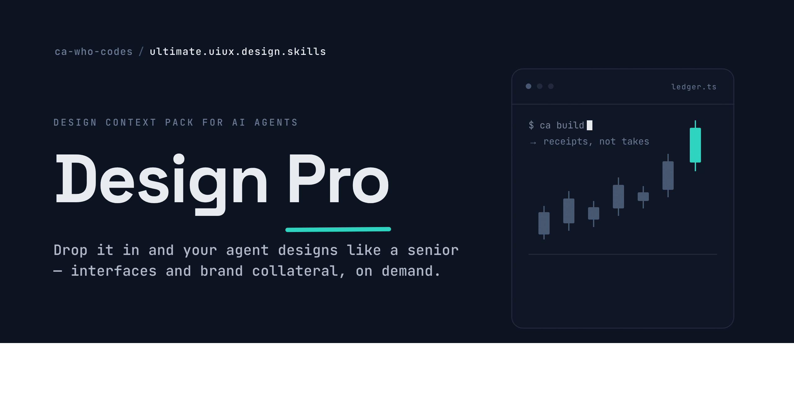

<div align="center">

# 🎨 Design Pro

### The ultimate, one-stop design context pack for AI coding agents.

**Drop it into any project and your agent designs like a senior — across two tracks: 🖥️ interfaces (web, apps, components) and 🎨 visual & marketing collateral (decks, social carousels, posters, email, brand kits). The taste of Linear/Stripe/Vercel and top brand studios, the rigor of WCAG, and a real production pipeline — all on demand.**

Works with **Claude Code**, **Cursor**, **Windsurf**, **Copilot**, and any agent that reads `AGENTS.md`.

</div>

---

## What this is

Most AI-generated UI looks the same: three accent colors, gradients everywhere, everything centered, only the happy path, no focus states. The model has plenty of raw knowledge but **no operating procedure and no taste calibration.**

Design Pro fixes that. It's a **progressive-disclosure knowledge base** — ~35 dense, agent-optimized reference files covering principles, visual foundations, components, motion, accessibility, page patterns, a modern build stack, **and** presentations, social creatives, print/posters, email, brand systems, and a real production pipeline — wired together so an agent reads *only what each task needs*, designs through a repeatable loop, and self-reviews against a 100+ point checklist before declaring done.

### Two tracks, one repo

| 🖥️ Interfaces | 🎨 Visual & marketing design |
|---|---|
| Web pages, apps, dashboards | Presentations / decks / PPT |
| Components, forms, navigation | Social carousels, posts, stories, ads, thumbnails |
| Design systems & tokens | A4/A3 posters, flyers, brochures, business cards |
| Landing, pricing, auth, data UI | Event banners & signage |
| React + Tailwind + shadcn build | Email & newsletters, infographics, brand kits |

Both share the same foundations (color, type, spacing, contrast, accessibility) and the same QA bar.

### It ships two ways at once

- 🧩 **A Claude Code plugin** — a `ui-ux-pro` skill that auto-activates on design requests, plus commands (`/ui-build`, `/ui-review`, `/design-system`, `/make-deck`, `/make-carousel`, `/make-creative`) and `ui-designer` / `frontend-implementer` / `visual-designer` / `design-reviewer` subagents.
- 📁 **A portable knowledge base** — `AGENTS.md` + `CLAUDE.md` + `knowledge/` that any agent (or human) can read directly. No lock-in.

## Why it's different

| Typical AI UI | With UI/UX Design Pro |
|---|---|
| Generic, cluttered, "AI-looking" | Restrained, hierarchical, crafted |
| Forgets loading/empty/error states | Every view handles all 5 states |
| Random spacing, failing contrast | 8pt grid, WCAG-checked contrast |
| `<div>` soup, no keyboard support | Semantic HTML, focus rings, ARIA |
| Decorative animation | Motion that communicates state |
| Dumps everything into context | Loads only what the task needs |

## Quickstart

### Option A — Claude Code plugin (recommended)

Install straight from this repo's built-in marketplace — no clone needed:

```text
/plugin marketplace add ca-who-codes/ultimate.UIUX.design.skills
/plugin install ui-ux-design-pro@ultimate-uiux-design-skills
```

Then just ask, or use the commands:

```text
# Interfaces
Design a pricing page for a B2B SaaS
/ui-build a settings form with profile, security, and notifications
/ui-review src/components/Dashboard.tsx
/design-system fintech, trustworthy, modern, brand #4F46E5

# Visual & marketing
/make-deck a seed pitch deck for an AI fintech
/make-carousel "7 onboarding mistakes", Instagram
/make-creative an A3 event poster for a hackathon
/make-creative a product-launch newsletter
```

The `ui-ux-pro` skill activates automatically whenever a request involves interface work. Prefer a local copy? `git clone https://github.com/ca-who-codes/ultimate.UIUX.design.skills.git` and add the folder via `/plugin marketplace add ./ultimate.UIUX.design.skills`.

### Option B — Any agent (Cursor / Windsurf / Copilot / etc.)

Drop this repo (or just `AGENTS.md` + `knowledge/`) into your project root. Most modern agents auto-read `AGENTS.md`. That's it — the agent now follows the design loop and pulls from `knowledge/` on demand.

### Option C — Reference it manually

Point any model at [`knowledge/INDEX.md`](knowledge/INDEX.md) and let it route from there. Humans can read it too — it's a genuinely good UI/UX handbook.

## What's inside

```
knowledge/
├── INDEX.md                 ← start here: map + routing table
│  ── shared foundations ──
├── 01-principles/           Laws of UX, heuristics, Gestalt + a decision framework
├── 02-foundations/          color · typography · layout/spacing · design tokens
├── 05-quality/              accessibility · responsive · performance · review checklist
│  ── 🖥️ Track A: interfaces ──
├── 03-components/           components · forms · navigation · data display
├── 04-interaction/          motion · microinteractions · states & feedback
├── 06-patterns/             landing · dashboards · auth/onboarding · pricing/ecommerce
├── 07-implementation/       tech stack · recipes (copy-paste code) · ecosystem
│  ── 🎨 Track B: visual & marketing design ──
├── 08-visual-composition/   format-specs (dimensions cheat-sheet) · composition · imagery & icons · brand systems
├── 09-presentations/        decks · pitch decks · slides
├── 10-social-creatives/     carousels · posts · stories · thumbnails · ads
├── 11-print-and-events/     posters · flyers · brochures · cards · banners · signage
├── 12-email-design/         email & newsletter design
└── 13-production/           how to render it: HTML→PNG/PDF/PPTX/MP4, Express/Canva, Remotion
```

Plus plugin wiring: `skills/ui-ux-pro/SKILL.md`, `agents/*`, `commands/*`, `.claude-plugin/plugin.json`.

A standout file: [`08-visual-composition/format-specs.md`](knowledge/08-visual-composition/format-specs.md) — a single cheat-sheet for every canvas size, aspect ratio, safe zone, DPI, bleed, and color space (social, slides, print, email, video).

Every knowledge file is opinionated and **specific** — real values (`16px body`, `4.5:1 contrast`, `cubic-bezier(0.4,0,0.2,1)`), do/don't tables, and an *Agent checklist* at the end. No vibes-only advice.

## The non-negotiables

The spine that runs through every file:

1. **One primary action per screen.**
2. **8pt spacing scale** (4/8/12/16/24/32/48/64).
3. **Type:** 16px body min, line-height ~1.5, measure 45–75ch.
4. **Contrast:** 4.5:1 text, 3:1 large/UI.
5. **Every view handles 5 states:** empty, loading, error, success, ideal.
6. **Semantic HTML + visible focus + keyboard operable.**
7. **Motion:** only `transform`/`opacity`, 150–300ms, ease-out, with `prefers-reduced-motion`.
8. **Restraint** over decoration.

## Recommended stack

React + TypeScript · Tailwind CSS v4 · shadcn/ui + Radix · Motion (Framer Motion) · Lucide · `cva` + `cn()`. Philosophy: **own your styling, borrow your behavior.** Full rationale and alternatives (Vue/Svelte/native) in [`knowledge/07-implementation/tech-stack.md`](knowledge/07-implementation/tech-stack.md).

## Credits & ecosystem

Built as a judgment + procedure layer on top of a rich open ecosystem. The [`ecosystem`](knowledge/07-implementation/ecosystem.md) reference maps the best tools to reach for, including the projects that inspired this repo:

- [**ui-layouts**](https://github.com/ui-layouts) — creative React + Tailwind + Framer Motion components, effects & blocks.
- [**cult/ui**](https://github.com/nolly-studio/cult-ui) — shadcn-compatible animated components for design engineers.
- [**SuperSplat**](https://github.com/playcanvas/supersplat) — browser 3D Gaussian Splat editor (immersive 3D surfaces).
- [**Remotion**](https://github.com/remotion-dev/remotion) — make videos programmatically with React.
- [**RuView**](https://github.com/ruvnet/RuView) — WiFi-sensing → spatial intelligence (ambient, camera-free UX).
- [**ui-ux-pro-max-skill**](https://github.com/nextlevelbuilder/ui-ux-pro-max-skill) — AI design-system generation skill.
- [**StringTune Skill Hub**](https://string-tune.fiddle.digital/skill-hub) — CSS-first, JS-light interaction philosophy.

For **production**, the [`production-and-tools`](knowledge/13-production/production-and-tools.md) reference routes each artifact to a concrete path: HTML→PNG/PDF, programmatic `.pptx`, Adobe Express / Canva, and Remotion for video.

Standards of craft to benchmark against: Linear, Stripe, Vercel, Raycast, Mobbin.

**Pairs with a marketing-skills library.** This repo owns the *visual design craft*; for marketing *copy, strategy, and distribution* (ad copy, subject lines, SEO, CRO, deliverability), pair it with a copy/growth skill set. Design here; write and distribute there.

## License

MIT — see [`LICENSE`](LICENSE). Use it, fork it, ship better interfaces.

---

<div align="center">
<sub>Clarity over cleverness. Polish over decoration. Ship interfaces people love.</sub>
</div>
